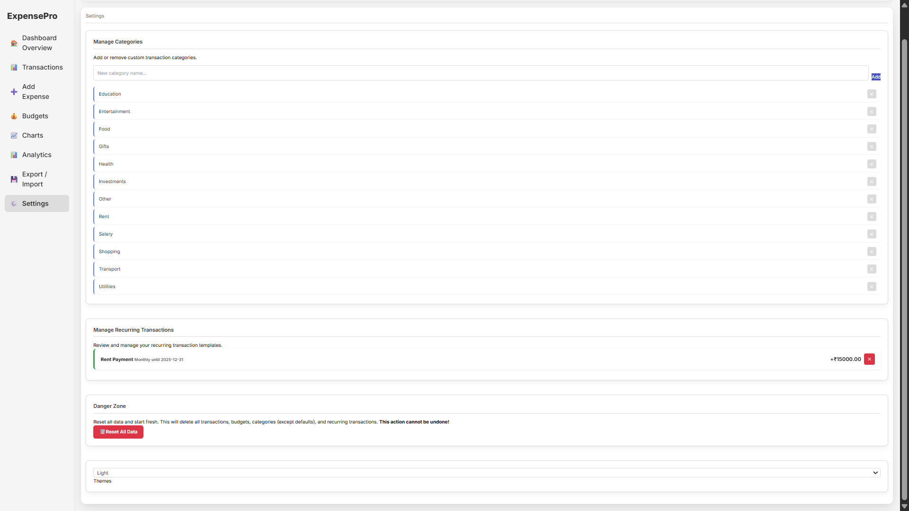

<div align="center">


# ExpensePro: Personal Finance Tracker

**Track, Budget, and Analyze Your Finances with Ease**

</div> 

<div align="center">

[](https://github.com/jenishpatel/expansepro/)
[](https://opensource.org/licenses/MIT)
[](CONTRIBUTING.md)
[](http://makeapullrequest.com)

</div>

**ExpensePro** is a powerful, client-side web application designed to give you complete control over your personal finances. Built with modern web technologies, it offers a seamless and intuitive experience for tracking transactions, managing budgets, and gaining deep analytical insights into your spending habits. All your data stays private, stored directly in your browser.

<!-- 🔴 EDIT THIS: Replace with your actual live demo link -->
### **[➡️ View Live Demo](https://your-live-demo-link.com)**

---

## 📸 Project Gallery

<table align="center">
  <tr>
    <!-- 🔴 EDIT THIS: Ensure these image paths are correct -->
    <td align="center" width="50%"><br><sub><b>Dynamic Dashboard</b></sub></td>
    <td align="center" width="50%"><br><sub><b>Advanced Analytics</b></sub></td>
  </tr>
  <tr>
    <td align="center" width="50%"><br><sub><b>Smart Budgeting</b></sub></td>
    <td align="center" width="50%"><br><sub><b>Transaction History</b></sub></td>
  </tr>
   <tr>
    <td align="center" width="50%"><br><sub><b>Themes & Customization</b></sub></td>
    <td align="center" width="50%"><br><sub><b>Fully Responsive Design</b></sub></td>
  </tr>
</table>

---

## ✨ Core Features

ExpensePro is packed with features to provide a complete financial management toolkit.

| Feature | Description |
| :--- | :--- |
| 📊 **Dynamic Dashboard** | Get an instant overview of your total income, expenses, and net savings. Visual charts for category distribution and monthly trends provide a quick financial snapshot. |
| 💸 **Transaction Management** | Easily add, categorize, and view all your income and expense transactions. Filter your history by date or search for specific items. |
| 🔄 **Recurring Transactions** | Automate your workflow by setting up recurring weekly or monthly transactions for bills, subscriptions, or regular income. |
| 🎯 **Smart Budgeting** | Create monthly budgets for different spending categories. Track your progress with dynamic bars that change color as you approach your limit. |
| 📈 **Advanced Analytics** | Dive deep into your data with dedicated **Daily, Monthly, and Yearly** analytics views. Understand trends and identify spending patterns over time. |
| 🎨 **Theme Engine** | Personalize your experience with **12 beautiful themes**, including light, dark, and various color-based options. |
| 🌐 **Multi-Language Support** | The interface is fully translated into **English**, **Hindi (हिन्दी)**, and **Gujarati (ગુજરાતી)**. |
| 💾 **Data Portability** | **Export** your entire transaction history to a CSV file. **Import** data from the included `demo_data.csv` or your own file. |
| 📱 **Fully Responsive** | Enjoy a seamless experience on any device, whether it's a desktop, tablet, or mobile phone. |

---

## 🛠️ Tech Stack & Architecture

This project leverages modern, client-side technologies to deliver a fast and private user experience.

<div align="center">


</div>

The application is architected with a modular approach for better maintainability.

<details>
<summary><strong>Click to view Project Architecture Details</strong></summary>

| File / Directory | Purpose |
| :--- | :--- |
| `index.html` | The single entry point for the application. |
| `css/style.css` | Contains all custom CSS, theme variables, and responsive design queries. |
| `js/main.js` | The core of the application; initializes the app and handles main event listeners. |
| `js/ui.js` | Manages all DOM manipulations, panel switching, and modal handling. |
| `js/data.js` | The data layer; handles all interactions with Local Storage and data import/export. |
| `js/transactions.js` | Contains logic for adding/deleting transactions. |
| `js/budgets.js` | Manages all logic related to budget management. |
| `js/charts.js` | Responsible for rendering all charts using Chart.js. |
| `js/analytics.js` | Powers the entire Analytics panel and its views. |
| `js/categories.js` | Handles the management of spending categories. |
| `js/themes.js` | Defines all 12 color themes and the logic to apply them. |
| `js/langManager.js` | Manages fetching and applying multi-language translations. |
| `lang/` | Holds the JSON files for each supported language. |

</details>

---

## 🚀 Getting Started

To get a local copy up and running, follow these simple steps.

### Prerequisites

All you need is a modern web browser. For the best experience during development, it's recommended to use a live server.

### Installation & Setup

1.  **Clone the repository:**

    ```sh
    git clone [https://github.com/jenishpatel/expansepro.git](https://github.com/your-username/expansepro.git)
    ```
2.  **Navigate to the project directory:**
    ```sh
    cd expansepro
    ```
3.  **Run with a Live Server:**
    * If you're using VS Code, install the [Live Server](https://marketplace.visualstudio.com/items?itemName=ritwickdey.LiveServer) extension.
    * Right-click on `index.html` and select "Open with Live Server".
    * This will open the project in your browser and correctly load all necessary files.

---

## 💡 Using the Demo Data File

This repository includes a `demo_data.csv` file so you can quickly and easily test all of the application's features.

1.  **Locate the File:** The `demo_data.csv` file is already included in the root of this project.
2.  **Import into ExpensePro:**
    * In the app, navigate to the **Export / Import** panel.
    * Under "Import Transactions," click "Choose File" and select the `demo_data.csv` file.
    * Click the "Import from CSV" button. The app will be instantly populated with data for you to explore!

---

## 🤝 How to Contribute

Contributions are the backbone of the open-source community and are **greatly appreciated**. If you have a suggestion that would make this project better, please fork the repo and create a pull request.

1.  Fork the Project
2.  Create your Feature Branch (`git checkout -b feature/AmazingFeature`)
3.  Commit your Changes (`git commit -m 'Add some AmazingFeature'`)
4.  Push to the Branch (`git push origin feature/AmazingFeature`)
5.  Open a Pull Request

Please read `CONTRIBUTING.md` for our code of conduct and more details.

---

## 📜 License

This project is distributed under the MIT License. See `LICENSE.txt` for more information.

---

## ⭐ Show Your Support

If you find this project useful, please give it a ⭐️ to show your support!
